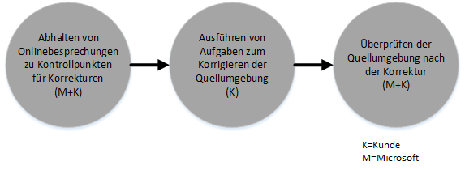
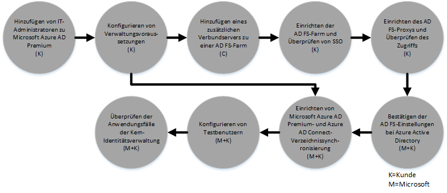

# Prozess f&#252;r das Fast Track Center-Leistungsangebot f&#252;r Azure Active Directory Premium 
Wenn Ihre Organisation für das FastTrack Center-Leistungsangebot für Microsoft Azure AD Premium berechtigt ist, können Sie mit Microsoft-Spezialisten remote zusammenarbeiten, um Ihre Microsoft Azure AD Premium-Umgebung in Betrieb zu nehmen. Ob Ihre Organisation berechtigt ist, erfahren Sie unter [Fast Track Center-Leistungsangebot für Azure Active Directory Premium](../Topic/FastTrack_Center_Benefit_for_Azure_Active_Directory_Premium.md).

Dieser Artikel bietet folgende Informationen:

-   [Overview of the onboarding process](#overview)

-   [Expectations for your source environment](#expectations_src_environ)

-   [Phases of the onboarding process](#phases_onboarding_process)

-   [Microsoft responsibilities](#microsoft_responsibilities) für jede Phase

-   [Your responsibilities](#your_responsibilities) für jede Phase

Nachstehend wird erklärt, was Sie nach Abschluss des Onboardings erwarten können:

-   Ihr Microsoft Azure AD Premium-Mandant wird erstellt.

-   Lizenzierte Benutzer können auf die Microsoft Azure AD Premium-Dienste über eine der folgenden Identitätsoptionen zugreifen:

    -   Cloudidentitäten (eindeutige Microsoft Azure AD Premium-Konten)

    -   Synchronisierte Identitäten: Microsoft Azure AD Premium-Konten, die für Kunden mit einer einzelnen Gesamtstruktur oder mehreren Active Directory-Gesamtstrukturen mithilfe des Azure Active Directory Connect-Tools (Azure AD Connect) aus der lokalen Active Directory-Bereitstellung synchronisiert werden.

    -   Identitätsverbund – mit Microsoft Azure AD Premium-Konten, auf die Folgendes zutrifft:

        -   Mithilfe des Microsoft Azure AD Connect-Tools aus Active Directory synchronisiert bei Kunden, deren Konfiguration aus einer einzelnen Active Directory-Gesamtstruktur besteht.

        -   Verbund mithilfe von with Active Directory Federation Services (AD FS) 2.0 oder höher aus dem lokalen Active Directory.

## Übersicht über den Onboarding-Prozess
Das Onboarding besteht aus zwei wesentlichen Komponenten:

-   **Hauptaufgaben**: Hierzu zählen Aktivitäten, die bei Bedarf für die Mandantenkonfiguration und -integration in Azure AD ausgeführt werden müssen. Die Hauptaufgaben stellen auch die Konfigurationsbaseline für das Onboarding weiterer berechtigter Microsoft Online-Dienste dar.

-   Das **Onboarding von Diensten** umfasst die Aufgaben, die zum Konfigurieren von eigenständigen Microsoft Azure AD Premium-Umgebungen oder Umgebungen mit Azure AD Connect-Verzeichnissynchronisierung oder AD FS erforderlich sind.

Im folgenden Diagramm wird der Zeitrahmen für die Nutzung des FastTrack Center-Leistungsangebots beschrieben.

Der Prozess ist grundlegend wie folgt:

-   Microsoft wird versuchen, sich innerhalb von 30 Tagen nach dem Erwerb eines berechtigten Tarifs mit Ihnen in Verbindung setzen. Sie können auch Unterstützung über das [FastTrack Center](http://fasttrack.microsoft.com/) anfordern, wenn Sie bereit sind, diese Dienste in Ihrer Organisation bereitzustellen. Wenn Sie Unterstützung wünschen, melden Sie sich beim FastTrack Center (http://fasttrack.microsoft.com) an, wechseln zum Dashboard, wählen den Namen Ihres Unternehmens, klicken auf die Registerkarte für Angebote und dann auf die Schaltfläche zum Anfordern von Unterstützung für den berechtigten Dienst. Sobald der Onboarding-Support begonnen hat, richten wir einen Zeitplan für Onlinebesprechungen ein.

-   Das Microsoft-Team unterstützt Sie bei den Hauptaufgaben und anschließend beim Onboarding der einzelnen berechtigten Dienste.

Der gesamte Onboarding-Support wird von zugeteilten Microsoft-Mitarbeitern remote geleistet:

-   Microsoft unterstützt Sie remote bei verschiedenen Onboarding-Aktivitäten mithilfe einer Kombination aus Tools, Dokumentation und Leitfäden. Wenn Microsoft bestimmte Konfigurationsaufgaben für Sie ausführen soll, können Sie sich dafür entscheiden, Microsoft entsprechenden Zugriff und die erforderlichen Berechtigungen für das Ausführen dieser Aufgaben zu erteilen.

-   Onboarding-Support wird vom FastTrack Center geboten und steht in der jeweiligen Region zu den üblichen Geschäftszeiten zur Verfügung.

-   Onboarding-Support wird in den folgenden Sprachen geboten: Deutsch, Englisch, Französisch, Italienisch, Japanisch, Portugiesisch (Brasilien), Spanisch und traditionelles Chinesisch.

-   Das Microsoft-Team kann direkt mit Ihnen oder Ihrem Vertreter zusammenarbeiten.

## Anforderungen an die Quellumgebung
Möglicherweise verfügen Sie bereits in Ihrer Quellumgebung, die Sie in Microsoft Azure AD Premium integrieren möchten, um die umfassende Identitätsverwaltung von einer einzelnen Konsole aus nutzen zu können, lokal über Microsoft Active Directory. Das FastTrack Center-Leistungsangebot umfasst Hilfestellung beim Integrieren von Microsoft Azure AD Premium mit Ihrer lokalen Implementierung. Falls eine Integration erforderlich ist, muss sich Ihre Quellumgebung auf der Mindeststufe für die jeweilige Anwendung befinden.

In der folgenden Tabelle werden die Anforderungen an die vorhandene Quellumgebung für das Onboarding beschrieben.

|Aktivität|Anforderung an die Quellumgebung|
|-------------|------------------------------------|
|Hauptaufgaben|Active Directory-Gesamtstrukturen mit Windows Server 2008 oder höher als Funktionsgesamtstrukturebene mit der folgenden Gesamtstrukturkonfiguration:  -   Einzelne Active Directory-Gesamtstruktur -   Mehrere Active Directory-Gesamtstrukturen **Note:** Für alle Konfigurationen mit mehreren Gesamtstrukturen wird die AD FS-Bereitstellung im Rahmen des FastTrack Center-Leistungsangebots nicht berücksichtigt.|
|Onboarding von Diensten  -   Microsoft Azure AD Premium|Das lokale Active Directory und die lokale Umgebung wurden für Azure AD Premium vorbereitet, was auch die erneute Behebung bekannter Probleme bedeutet, die die Integration mit Funktionen von Azure AD und Azure AD Premium verhindern.|

## Phasen im Onboarding-Prozess
Microsoft Azure AD Premium-Onboarding erfolgt in fünf Hauptphasen, wie aus der folgenden Abbildung zu ersehen:

-   Einleiten

-   Analysieren

-   Korrigieren

-   Aktivieren

-   Schließen

Detaillierte Aufgaben für jede Phase finden Sie in den Abschnitten [Microsoft responsibilities](#microsoft_responsibilities) und [Your responsibilities](#your_responsibilities).

### Einleitungsphase
Nachdem Sie die gewünschten Anzahl von Lizenzen erworben haben, befolgen Sie die Anleitung in der E-Mail zur Kaufbestätigung, um die Lizenzen Ihrem vorhandenen oder neuen Mandanten zuzuordnen. Microsoft prüft, ob Sie zur Inanspruchnahme des FastTrack Center-Leistungsangebots berechtigt sind. Microsoft wird versuchen, sich innerhalb von 30 Tagen nach dem Erwerb eines berechtigten Tarifs mit Ihnen in Verbindung setzen. Sie können auch Unterstützung über das [FastTrack Center](http://fasttrack.microsoft.com/) anfordern, wenn Sie bereit sind, diese Dienste in Ihrer Organisation bereitzustellen. Wenn Sie Unterstützung wünschen, melden Sie sich beim FastTrack Center (http://fasttrack.microsoft.com) an, wechseln zum Dashboard, wählen den Namen Ihres Unternehmens, klicken auf die Registerkarte für Angebote und dann auf die Schaltfläche zum Anfordern von Unterstützung für den berechtigten Dienst. Sobald der Onboarding-Support begonnen hat, richten wir einen Zeitplan für Onlinebesprechungen ein.

In dieser Phase besprechen wir den Onboarding-Prozess, überprüfen Daten und setzen eine Einführungsbesprechung an.

### Analysephase
Nachdem der Onboarding-Prozess eingeleitet wurde, arbeitet Microsoft bei der Analyse Ihrer Quellumgebung und der Anforderungen mit Ihnen zusammen. Tools werden zur Beurteilung Ihrer Umgebung ausgeführt, und Microsoft begleitet Sie durch die Analyse Ihres lokalen Active Directorys, von Internetbrowsern, Betriebssystemen von Clientgeräten, des DNS-Systems, des Netzwerks, der Infrastruktur und des Identitätsverwaltungssystems, um zu bestimmen, ob für das Onboarding Änderungen erforderlich sind. Basierend auf Ihrer aktuellen Einrichtung erstellen wir einen Korrekturplan. Nach Befolgen dieses Plans wird Ihre Quellumgebung an die Mindestanforderungen für ein erfolgreiches Onboarding für Microsoft Azure AD Premium angepasst. Für die Korrekturphase setzen wir auch entsprechende Telefonkonferenzen an.

### Korrekturphase
Bei Bedarf führen Sie die Aufgaben im Korrekturplan für Ihre Quellumgebung aus, damit Sie die Anforderungen für das Onboarding der einzelnen Dienste erfüllen.

Vor Einleiten der Aktivierungsphase überprüfen wir gemeinsam die Ergebnisse der Korrekturaktivitäten, um sicherzustellen, dass Sie auf dem benötigten Stand sind.

### Aktivierungsphase
Nach Abschluss aller Korrekturaktivitäten ist der nächste Schritt im Projekt die Konfiguration der Kerninfrastruktur für die Nutzung der Dienste und die Bereitstellung von Microsoft Azure AD Premium.

**Aktivierungsphase – Hauptaufgaben**

Zu den Hauptaufgaben zählen die Bereitstellung von Diensten sowie die Integration von Mandant und Identitätsverwaltung. Ferner gehören dazu grundlegende Schritte für das Onboarding von Microsoft Azure AD Premium.

Das Onboarding für Microsoft Azure AD Premium kann beginnen, sobald das Haupt-Onboarding abgeschlossen ist.

**Aktivierungsphase – Microsoft Azure AD Premium**

Abhängig von den Anforderungen kann die Microsoft Azure AD Premium-Umgebung mit der Azure AD Connect-Verzeichnissynchronisierung und den Active Directory-Verbunddiensten (AD FS) eingerichtet werden.

Für Microsoft Azure AD Premium-Szenarien, die die Synchronisierung von lokalen Identitäten mit der Cloud umfassen, unterstützen wir Sie durch Hinzufügen von Administratoren und Benutzern zu Ihrem Abonnement, das Konfigurieren von Verwaltungsvoraussetzungen, das Einrichten von Microsoft Azure AD Premium, das Einrichten der Verzeichnissynchronisierung mithilfe von Azure AD Connect und Active Directory-Verbunddiensten mit Azure AD Connect, das Konfigurieren von Testbenutzern und das Überprüfen Ihrer wichtigsten Anwendungsfälle.

Das Installationsprogramm von Microsoft Azure AD Premium aktiviert die folgenden Funktionen:

-   Self Service-Kennwortzurücksetzung (SSPR)

-   Azure Multi-Factor Authentication (MFA)

-   SaaS-Anwendung (Software-as-a-Service) – Einrichten einer SaaS-Anwendung

-   Self-Service-Gruppenverwaltung (SSGM)

-   Administratorberichte

## Zuständigkeiten von Microsoft

### Allgemein

-   Wir bieten Ihnen Remotesupport und Hilfe bei den erforderlichen Konfigurationsaufgaben gemäß den ausführlichen Beschreibungen der einzelnen Phasen.

-   Wir stellen verfügbare Dokumentation und Softwaretools, Verwaltungskonsolen und Skripts zur Verfügung, damit Sie Konfigurationsaufgaben verringern oder ganz weglassen können.

Das Erteilen von Zugriff und Berechtigungen an Microsoft ist für die Nutzung des FastTrack Center-Leistungsangebots nicht erforderlich. In einigen Fällen können Sie sich entscheiden, Microsoft entsprechenden Zugriff und entsprechende Berechtigungen zum Ausführen bestimmter Aktivitäten in Ihrem Auftrag zu erteilen.

### Einleitungsphase

-   Sie werden binnen 30 Tagen nach Kauf berechtigter Lizenzen für einen neuen Mandanten kontaktiert.

-   Wir arbeiten mit Ihnen zusammen, um das Onboarding binnen 90 Tagen nach Kauf berechtigter Lizenzen einzuleiten.

-   Festlegen, für welche berechtigten Dienste das Onboarding erfolgen soll.

### Analysephase

-   Bereitstellen einer administrativen Übersicht

-   Bereitstellen von Anleitungen zu:

    -   DNS-, Netzwerk- und Infrastrukturanforderungen

    -   Clientanforderungen (benötigte Internetbrowser, Clientbetriebssysteme und Dienste)

    -   Bereitstellen von Benutzeridentitäten und -konten

    -   Bestimmung der Anforderungen an die Verzeichnissynchronisierung

    -   Bestimmung, ob die Kennworthash-Synchronisierung den Kundenanforderungen entspricht oder ob AD FS erforderlich ist

    -   Aktivieren berechtigter Dienste, die erworben und als Teil des Onboardings festgelegt wurden

    -   Bestimmen der Anforderungen an die benötigten Pilot- und Testumgebungen, z. B. Testkonten, Testinstanz der SaaS-Anwendung (z. B. SalesForce)

-   Festlegen des Zeitrahmens für Korrekturaktivitäten

-   Bereitstellen einer Checkliste für die Korrekturen

### Korrekturphase

-   Abhalten von Telefonkonferenzen mit Ihnen gemäß dem vereinbarten Zeitplan zum Überprüfen des Fortschritts der Korrekturaktivitäten

-   Unterstützen der Ausführung von Tools zum Bestimmen und Beheben von Problemen und Interpretieren der Ergebnisse

### Aktivierungsphase
Bereitstellen von Anleitungen zum:

-   Aktivieren Ihres Microsoft Azure AD Premium-Mandanten

-   Konfigurieren der Firewallports

-   Konfigurieren von DNS für berechtigte Dienste

-   Überprüfen der Konnektivität mit den Microsoft Azure AD Premium-Diensten

-   Für eine Umgebung mit einer einzelnen Gesamtstruktur:

    -   Installieren einer Verzeichnissynchronisierung zwischen Ihren Active Directory-Domänendiensten (AD DS) und Azure AD , falls erforderlich

    -   Konfigurieren der Kennwortsynchronisierung mit dem Azure AD Connect-Tool

-   Für eine Umgebung mit mehreren Gesamtstrukturen:

    -   Installieren von Azure AD Connect-Synchronisierung mit einer geeigneten Einrichtung für Szenarien mit mehreren Gesamtstrukturen. Beachten Sie, dass die Kennworthash-Synchronisierung und das Kennwortrückschreiben mehrere Gesamtstrukturen unterstützen.  Andere Rückschreibeszenarien werden jedoch nicht unterstützt.

    -   Konfigurieren der Synchronisierung zwischen lokalen Active Directory-Gesamtstrukturen und dem Microsoft Azure AD Premium-Verzeichnis (Azure Active Directory).

        > [!NOTE]
        > Die Entwicklung und Implementierung benutzerdefinierter Regelerweiterungen bleiben unberücksichtigt.

-   Für eine einzelne Gesamtstruktur mit Verbundidentitäten als Ziel: Installieren und Konfigurieren von Active Directory-Verbunddiensten (AD FS) für die lokale Domänenauthentifizierung mit Microsoft Azure AD Premium in einer fehlertoleranten Konfiguration für einen Einzelstandort, falls erforderlich.

    > [!NOTE]
    > Für alle Konfigurationen mit mehreren Gesamtstrukturen bleiben AD FS-Bereitstellungen unberücksichtigt.

-   Testen der Funktionalität für einmaliges Anmelden, sofern bereitgestellt.

#### Aktivierungsphase – Azure AD Premium mit Azure AD Connect und AD FS
Bereitstellen von Anleitungen zum Einrichten von:

-   Benutzerbereitstellung, einschließlich Lizenzierung

-   Azure AD Connect-Verzeichnissynchronisierung (mit Kennwortrückschreiben und Kennworthash-Synchronisierung)

-   Active Directory-Verbunddiensten (AD FS)

-   Self Service-Kennwortzurücksetzung (SSPR)

-   Mehrstufiger Azure-Authentifizierung (MFA)

-   Eine integrierte Anwendung, die das einmalige Anmelden für SaaS-Anwendungen umfassen kann.

-   Nutzungs- und Sicherheitsberichten für Administratoren

-   Self-Service-Gruppenverwaltung (SSGM)

-   Anwendungsproxy

-   Administratorbenachrichtigungen

-   Angepasstem Anmeldebildschirm, einschließlich Logo, Text und Bildern

## Ihre Zuständigkeiten
In diesem Abschnitt werden verschiedene Ihrer Zuständigkeiten während des Onboarding-Prozesses beschrieben.

### Allgemein

-   Beliebige Optimierungen und Integrationen für Ihren Microsoft Azure AD Premium-Mandanten, die über die in diesem Artikel angegebenen konfigurierbaren Optionen hinausgehen

-   Allgemeines Programm- und Projektmanagement Ihrer Ressourcen

-   Kommunikation mit den Endbenutzern, Dokumentation, Schulungen und Änderungsmanagement

-   Dokumentation und Schulung für das Helpdesk

-   Erstellen von Berichten, Präsentationen oder Besprechungsprotokollen, die für Ihre Organisation spezifisch sind

-   Erstellen von systemarchitekturbezogener und technischer Dokumentation spezifisch für Ihre Organisation

-   Entwerfen, Beschaffen, Installieren und Konfigurieren von Hardware und Netzwerk

-   Beschaffen, Installieren und Konfigurieren von Software

-   Verwalten, Konfigurieren und Anwenden von Sicherheitsrichtlinien, die über diejenigen hinaus gehen, die zum Testen der Basiskonfiguration und -funktionalität Ihrer Microsoft Azure AD Premium-Dienste erstellt wurden

-   Registrieren von Benutzerkonten, die über die hinausgehen, die zum Testen der Basiskonfiguration und -funktionalität der Microsoft Azure AD Premium-Dienste verwendet wurden

-   Konfigurieren, Analysen, Überprüfen der Bandbreite, Testen und Überwachen des Netzwerks

-   Verwalten eines Genehmigungsprozesses für das Management technischer Änderungen und Erstellen dazugehöriger Dokumentation

-   Ändern des Betriebsmodells und der Betriebsleitlinien

-   Lokales Einrichten der mehrstufigen Authentifizierung

-   Außerbetriebsetzung und Entfernung von Quellumgebungen und Diensten, die zuvor vom Kunden verwendet wurden.

-   Erstellen und Verwalten Ihrer Testumgebung

-   Installieren von Service Packs und anderen erforderlichen Updates auf Infrastrukturservern

-   Bereitstellen und Konfigurieren öffentlicher SSL-Zertifikate

-   Verfassen des Hinweises mit den Nutzungsbedingungen, der auf den von Endbenutzern verwendeten Geräten konfiguriert und angezeigt wird

### Einleitungsphase

-   Zusammenarbeiten mit dem Microsoft-Team, um das Onboarding für berechtigte Dienste zu beginnen

-   Teilnehmen an der Projekteinführungsbesprechung, Verwalten und Leiten der Teilnehmer in Ihrer Organisation und Bestätigen des Zeitrahmens für Korrekturen

### Analysephase

-   Bestimmen entsprechender Teilnehmer (einschließlich eines Projektleiters) zum Ausführen der erforderlichen Analyseaktivitäten

-   Nach Wunsch können Sie Ihren Bildschirm für Microsoft freigeben, falls Sie Anleitungen zum Anwenden von Analysetools auf Ihre Umgebung oder Ihr Microsoft Azure AD Premium-Abonnement benötigen.

-   Teilnehmen an den Besprechungen zum Erstellen einer Checkliste für Korrekturen und Mitwirken am Gesamtplan einschließlich Infrastruktur, Netzwerk, Administration, Vorbereitung der Verzeichnissynchronisierung, Netzwerksicherheit und Themen zu Verbundidentitäten

-   Teilnehmen an den Besprechungen zum Ansatz bei der Bereitstellung von Benutzerkonten

-   Teilnehmen an Besprechungen zum Planen der Konfiguration von Onlinediensten

-   Erstellen eines Supportplans für die Migrationsbereitschaft

### Korrekturphase

-   Ausführen der erforderlichen Schritte zum Abschließen der in der Analysephase ermittelten Korrekturaktivitäten

-   Teilnehmen an Besprechungen des Projektstands

### Aktivierungsphase

-   Nach Wunsch können Ihren Bildschirm für Microsoft freigeben, falls Sie Anleitungen zum Vornehmen von Änderungen auf Ihre Umgebung oder Ihr Microsoft Azure AD Premium-Abonnement benötigen.

-   Verwalten von Ressourcen nach Bedarf

-   Konfigurieren netzwerkbezogener Elemente gemäß Anleitung von Microsoft

-   Durchführen einer Verzeichnisuntersuchung und Konfigurieren der Verzeichnissynchronisierung gemäß Anleitung von Microsoft

-   Konfigurieren sicherheitsrelevanter Infrastruktur (z. B. von Firewallports) gemäß Anleitung von Microsoft

-   Implementieren der entsprechenden Clientinfrastruktur

-   Implementieren eines Ansatzes zur Bereitstellung von Benutzerkonten gemäß Anleitung von Microsoft

-   Aktivieren verschiedener Dienste gemäß Anleitung von Microsoft

## Wünschen Sie weitere Informationen?
Mehr finden Sie unter [Microsoft Azure Active Directory](http://azure.microsoft.com/en-us/documentation/services/active-directory/) und [Enterprise Mobility Suite](http://www.microsoft.com/en-us/server-cloud/products/enterprise-mobility-suite/default.aspx).

