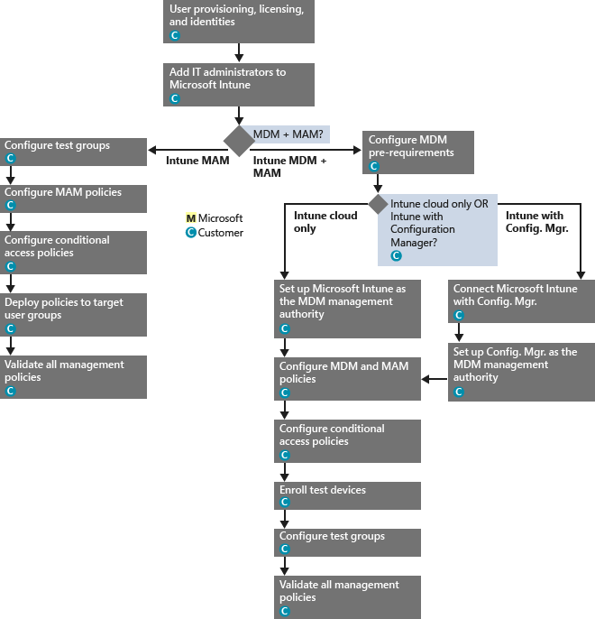

# Prozess f&#252;r das FastTrack Center-Leistungsangebot f&#252;r Intune
Wenn Ihre Organisation für den Microsoft Intune-Servicevorteil berechtigt ist, können Sie mit Microsoft-Spezialisten remote zusammenarbeiten, um Ihre Microsoft Intune-Umgebung in Betrieb zu nehmen.

Microsoft Intune ist Teil der Enterprise Mobility Suite (EMS) von Microsoft, die EMM-Funktionen (Enterprise Mobility Management) bereitstellt, z. B. die Verwaltung mobiler Geräte (Mobile Device Management, MDM) und Verwaltung mobiler Anwendungen (Mobile Application Management, MAM).  Mithilfe von Microsoft Intune können Sie Ihren Mitarbeitern durch das Bereitstellen und Konfigurieren von Geräten und das Bereitstellen mobiler Apps ermöglichen, auf mobilen Geräten produktiv zu werden.  Außerdem können Sie Microsoft Intune verwenden, um durch die Überwachung der Gerätekompatibilität, den Schutz mobiler Anwendungen und Daten sowie die Integration in Azure AD zum Steuern des Zugriffs auf Unternehmensdienste Ihre Unternehmensdaten zu schützen.

Unter [FastTrack Center-Angebot für Intune](../Topic/FastTrack_Center_Benefit_for_Intune.md) erfahren Sie, ob Ihre Organisation berechtigt ist. Wenn Sie interessiert sind, Ihre Umgebung für andere Enterprise Mobility Suite-Dienste vorzubereiten, finden Sie unter [FastTrack Center-Leistungsangebot für Enterprise Mobility Suite](../Topic/FastTrack_Center_Benefit_for_Enterprise_Mobility_Suite.md) die gewünschten Informationen.

**Suchen Sie nach Informationen zu Microsoft FastTrack für Office 365? Hier finden Sie Informationen zum** [FastTrack Center-Leistungsangebot für Office 365](https://technet.microsoft.com/library/office-365-onboarding-benefit.aspx).

Dieser Artikel enthält die folgendem Informationen zum Servicevorteil für Microsoft Intune:

-   [Overview of the onboarding process](#overview_onboarding_process)

-   [Expectations for your source environment](#expectations_src_environ)

-   [Phases of the onboarding process](#phases_onboarding_process)

-   [Microsoft responsibilities](#microsoft_responsibilities) für jede Phase

-   [Your responsibilities](#your_responsibilities) für jede Phase

Nachstehend wird erklärt, was Sie nach Abschluss des Onboardings erwarten können:

-   Ihr Microsoft-Onlinedienstmandant wird erstellt.

-   Lizenzierte Benutzer können auf den Microsoft Intune-Dienst über eine der folgenden Identitätsoptionen zugreifen:

    -   Cloudidentitäten (eindeutige Microsoft-Onlinedienstkonten)

    -   Synchronisierte Identitäten: Aus Ihrem lokalen Active Directory mithilfe von Azure Active Directory Connect (Synchronisierungsdiensten) synchronisierte Microsoft Intune-Konten:

        -   Für Kunden, deren Umgebung aus einer einzelnen Active Directory-Gesamtstruktur besteht.

        -   Für Kunden mit unterstützter Topologie aus mehreren Active Directory-Gesamtstrukturen.

-   Identitätsverbund – Microsoft Intune-Konten:

    -   Mithilfe des Microsoft Azure Active Directory Connect-Tools aus Active Directory synchronisiert für Kunden, deren Konfiguration aus einer einzelnen Active Directory-Gesamtstruktur besteht, oder für Kunden, deren Konfiguration aus einer einzelnen Active Directory-Kontengesamtstruktur (auch als „Anmeldegesamtstruktur“ bezeichnet) und einer einzelnen Active Directory-Ressourcengesamtstruktur besteht.

    -   Verbund mithilfe der Windows Server 2012 R2-Rolle „Active Directory-Verbunddienste“ aus dem lokalen Active Directory oder Verbund mithilfe von Active Directory-Verbunddiensten (AD FS) 2.0 oder höher aus dem lokalen Active Directory.

## Übersicht über den Onboarding-Prozess
Das Onboarding besteht aus zwei wesentlichen Komponenten:

-   **Hauptaufgaben**: Hierzu zählen Aktivitäten, die bei Bedarf für die Mandantenkonfiguration und -integration in Azure AD ausgeführt werden müssen. Diese Komponente stellt auch die Grundlage für das Onboarding anderer berechtigter Dienste dar.

-   **Onboarding für Dienste**: Dies umfasst Aufgaben, die für das Konfigurieren von Microsoft Intune ausgeführt werden müssen.

Im folgenden Diagramm wird die Abfolge der Ereignisse für die Nutzung des FastTrack Center-Leistungsangebots beschrieben.

Der Prozess ist grundlegend wie folgt:

-   Das FastTrack Center wird versuchen, sich innerhalb von 30 Tagen nach dem Erwerb eines berechtigten Tarifs mit Ihnen in Verbindung setzen. Sie können auch Unterstützung über das [FastTrack Center](http://fasttrack.microsoft.com/) anfordern, wenn Sie bereit sind, diese Dienste in Ihrer Organisation bereitzustellen. Wenn Sie Unterstützung wünschen, melden Sie sich beim [Fast Track Center](http://fasttrack.microsoft.com/) an, wechseln zum Dashboard, wählen den Namen Ihres Unternehmens aus, klicken auf der Registerkarte „Angebote“ auf die Schaltfläche zum Anfordern von Unterstützung für Microsoft Intune, Azure Active Directory Premium oder Azure Rights Management Premium.

-   Das FastTrack Center unterstützt Sie bei den Hauptaufgaben und anschließend beim Onboarding der einzelnen berechtigten Dienste.

Der gesamte Onboarding-Support wird von zugeteilten Microsoft-Mitarbeitern remote geleistet:

-   Microsoft unterstützt Sie remote bei verschiedenen Onboarding-Aktivitäten mithilfe einer Kombination aus Tools, Dokumentation und Leitfäden.

-   Onboarding-Support wird vom FastTrack Center geboten und steht in der jeweiligen Region zu den üblichen Geschäftszeiten zur Verfügung.

-   Onboarding-Support wird in den folgenden Sprachen geboten: Deutsch, Englisch, Französisch, Italienisch, Japanisch, Portugiesisch (Brasilien), Spanisch und traditionelles Chinesisch.

-   Das Microsoft-Team kann direkt mit Ihnen oder Ihrem Vertreter zusammenarbeiten.

## Anforderungen an die Quellumgebung
Ihre Quellumgebung weist ggf. bereits Dienste auf, die Sie entweder in Microsoft Intune verlagern oder mit diesem Dienst integrieren möchten. Bei einigen Diensten sieht das FastTrack Center-Angebot für Intune Hilfe beim Einrichten eines bestimmten Grads an Integration mit Ihrer Quellumgebung vor. Falls eine Integration erforderlich ist, muss sich Ihre Quellumgebung auf der Mindeststufe für die jeweilige Anwendung befinden.

In der folgenden Tabelle werden die Anforderungen an die vorhandene Quellumgebung für das Onboarding beschrieben.

|Aktivität|Anforderung an die Quellumgebung|
|-------------|------------------------------------|
|Hauptaufgaben|Active Directory-Gesamtstrukturen mit Windows Server 2008 oder höher als Funktionsgesamtstrukturebene mit der folgenden Gesamtstrukturkonfiguration:  -   Einzelne Active Directory-Gesamtstruktur -   Mehrere Active Directory-Gesamtstrukturen **Note:** Für alle Konfigurationen mit mehreren Gesamtstrukturen wird die AD FS-Bereitstellung im Rahmen des FastTrack Center-Leistungsangebots nicht berücksichtigt.|
|Onboarding von Diensten  -   Microsoft Intune -   Mit System Center Configuration Manager integriertes Microsoft Intune|Für die Verwaltung von Geräten mit System Center Configuration Manager 2012 R2 oder höher in Verbindung mit Microsoft Intune müssen IT-Administratoren die Anweisungen unter [Administratorcheckliste: Konfigurieren von Configuration Manager zum Verwalten mobiler Geräte mithilfe von Microsoft Intune](https://technet.microsoft.com/library/jj943763.aspx). **Note:** Der Servicevorteil sieht keine Unterstützung zum Einrichten oder Aktualisieren von System Center Configuration Manager entsprechend den Mindestanforderungen vor, die für in System Center Configuration Manager integriertes Microsoft Intune erfüllt sein müssen.|

## Phasen im Onboarding-Prozess
Das Onboarding besteht aus vier Hauptphasen:

-   Einleiten

-   Analysieren

-   Korrigieren

-   Aktivieren

Detaillierte Aufgaben für jede Phase finden Sie in den Abschnitten [Microsoft responsibilities](#microsoft_responsibilities) und [Your responsibilities](#your_responsibilities).

### Einleitungsphase
Nachdem Sie die gewünschten Anzahlen und Typen von Lizenzen erworben haben, befolgen Sie die Anleitung in der E-Mail zur Kaufbestätigung, um die Lizenzen Ihrem vorhandenen oder neuen Mandanten zuzuordnen. Das FastTrack Center prüft, ob Sie zur Inanspruchnahme des Servicevorteils berechtigt sind. Microsoft wird versuchen, sich innerhalb von 30 Tagen nach dem Erwerb eines berechtigten Tarifs mit Ihnen in Verbindung setzen. Sie können auch Unterstützung über das [FastTrack Center](http://fasttrack.microsoft.com/) anfordern, wenn Sie bereit sind, diese Dienste in Ihrer Organisation bereitzustellen. Wenn Sie Unterstützung wünschen, melden Sie sich beim [Fast Track Center](http://fasttrack.microsoft.com/) an, wechseln zum Dashboard, wählen den Namen Ihres Unternehmens aus, klicken auf der Registerkarte „Angebote“ auf die Schaltfläche zum Anfordern von Unterstützung für Microsoft Intune, Azure Active Directory Premium oder Azure Rights Management Premium.

In dieser Phase besprechen wir den Onboarding-Prozess, überprüfen Daten und setzen eine Einführungsbesprechung an.

### Analysephase
Nachdem der Onboarding-Prozess eingeleitet wurde, arbeitet Microsoft bei der Analyse Ihrer Quellumgebung und der Anforderungen mit Ihnen zusammen. Tools werden zum Erfassen von Daten ausgeführt, und Microsoft begleitet Sie durch die Analyse von Internetbrowsern, Clientbetriebssystemen, des DNS-Systems, des Netzwerks, der Infrastruktur und des Identitätsverwaltungssystems, um zu bestimmen, ob für das Onboarding Änderungen erforderlich sind. Basierend auf Ihrer aktuellen Einrichtung erstellen wir einen Korrekturplan. Nach Befolgen dieses Plans wird Ihre Quellumgebung an die Mindestanforderungen für ein erfolgreiches Onboarding für Microsoft Intune angepasst. Für die Korrekturphase setzen wir auch entsprechende Telefonkonferenzen an.

### Korrekturphase
Bei Bedarf führen Sie die Aufgaben im Korrekturplan für Ihre Quellumgebung aus, damit Sie die Anforderungen für das Onboarding der einzelnen Dienste erfüllen.

Vor Einleiten der Aktivierungsphase überprüfen wir gemeinsam die Ergebnisse der Korrekturaktivitäten, um sicherzustellen, dass Sie auf dem benötigten Stand sind.

### Aktivierungsphase
Nach Abschluss aller Korrekturaktivitäten ist der nächste Schritt im Projekt die Konfiguration der Kerninfrastruktur für die Nutzung der Dienste und die Bereitstellung von Microsoft Intune.

**Aktivierungsphase – Hauptaufgaben**

Zu den Hauptaufgaben zählen die Bereitstellung von Diensten sowie die Integration von Mandant und Identitätsverwaltung. Ferner gehören dazu grundlegende Schritte für das Onboarding von Microsoft Intune.

Das Onboarding für Microsoft Intune kann beginnen, sobald die Hauptaufgaben abgeschlossen sind.

**Aktivierungsphase: Microsoft Intune**

Für Microsoft Intune und basierend auf Ihrem mobilen Gerät sowie den Verwaltungsanforderungen der mobilen Anwendungen begleiten wir Sie, bis Sie bereit sind, Geräte mit Microsoft Intune zu verwalten. Die jeweiligen Schritte hängen von Ihrer Quellumgebung ab und können Folgendes umfassen:

-   Lizenzierung Ihrer Endbenutzer. Bei Bedarf bieten wir auch Hilfestellung bei der Aktivierung von Volumenlizenzen für Ihren Microsoft Clouddienstmandanten.

-   Konfigurieren der von Microsoft Intune zu verwendenden Identitäten, entweder mithilfe Ihrer lokalen Active Directory oder Cloudidentitäten.

-   Hinzufügen von Benutzern zu Ihrem Microsoft Intune-Abonnement, Definieren von IT-Administratorrollen, und Erstellen von Benutzer- und Gerätegruppen.

-   Konfigurieren der MDM-Autorität, basierend auf Ihren Verwaltungsanforderungen:

    -   Legen Sie Microsoft Intune als MDM-Autorität fest, wenn Microsoft Intune die einzige MDM-Lösung ist oder in Verbindung mit der MDM für Office 365 verwendet wird.

    -   Wenn Sie über eine vorhandene Implementierung von System Center Configuration Manager verfügen und die Verwaltungsfunktionen mit Microsoft Intune erweitern möchten, legen Sie Configuration Manager als MDM-Autorität fest.

        > [!NOTE]
        > Wenn MAM nur für Geräte, die sich im Besitz Ihrer Endbenutzer befinden, für freigegebene Geräte oder für Kiosk-Geräte genutzt werden soll, ist das Einrichten einer MDM-Autorität nicht erforderlich.

-   Wenn Ihre Aufgabe die Verwaltung mobiler Geräte (MDM) ist, stellen wir Ihnen Anleitungen zu folgenden Aufgaben bereit:

    -   Konfigurieren von Testgruppen für die Überprüfung von MDM-Verwaltungsrichtlinien

    -   Konfigurieren von MDM-Verwaltungsrichtlinien und -Diensten wie z. B.:

        -   Anwendungsbereitstellung für jede unterstützte Plattform über Weblinks oder Deep-Links

        -   Bedingte Zugriffsrichtlinien

        -   Bereitstellung von E-Mail-Profilen

        -   Einrichten des Microsoft Intune Exchange-Connectors (falls zutreffend)

    -   Registrieren von bis zu zwei Testgeräten jeder [unterstützten Plattform](https://technet.microsoft.com/library/dn600287.aspx) bei Ihrem Microsoft Intune- oder Configuration Manager mit Microsoft Intune-Dienst

    -   Verwenden von Hardware- und Softwareinventurberichten

-   Wenn Ihre Aufgabe die Verwaltung mobiler Anwendungen (MAM) ist, oder wenn Sie Ihre vorhandene Microsoft- oder Drittanbietern-MDM-Lösung um MAM-Richtlinien ergänzen möchten, stellen wir Ihnen Anleitungen zu folgenden Aufgaben bereit:

    -   Konfigurieren von MAM-Richtlinien für jede unterstützte Plattform

    -   Konfigurieren bedingter Zugriffsrichtlinien für verwaltete Apps

    -   Adressieren der entsprechenden Benutzergruppen mit den oben aufgeführten MAM-Richtlinien

    -   Verwenden von Nutzungsberichten für verwaltete Anwendungen

-   Wenn Ihre Aufgabe die PC-Verwaltung, stellen wir Ihnen Anleitungen zu folgenden Aufgaben bereit:

    -   Bei Bedarf: Installieren der Intune-Clientsoftware

    -   Verwenden der in Intune verfügbaren Software- und Hardwareberichte.

## Zuständigkeiten von Microsoft
In diesem Abschnitt werden einige der Zuständigkeiten von Microsoft während des Onboarding-Prozesses beschrieben.

### Allgemein

-   Wir bieten Ihnen Remoteunterstützung und Hilfe bei den erforderlichen Konfigurationsaufgaben gemäß den detaillierten Beschreibungen der einzelnen Phasen.

-   Wir stellen verfügbare Dokumentation und Softwaretools, Verwaltungskonsolen und Skripts zur Verfügung, damit Sie Konfigurationsaufgaben verringern oder ganz weglassen können.

### Einleitungsphase

-   Sie werden binnen 30 Tagen nach Kauf berechtigter Lizenzen für einen neuen Mandanten kontaktiert.

-   Zusammenarbeiten, um das Onboarding zu beginnen

-   Festlegen, für welche berechtigten Dienste das Onboarding erfolgen soll.

### Analysephase

-   Bereitstellen einer administrativen Übersicht

-   Bereitstellen von Anleitungen zu:

    -   DNS-, Netzwerk- und Infrastrukturanforderungen

    -   Clientanforderungen (benötigte Internetbrowser, Clientbetriebssysteme und Dienste)

    -   Bereitstellen von Benutzeridentitäten und -konten

    -   Aktivieren berechtigter Dienste, die erworben und als Teil des Onboardings festgelegt wurden

-   Festlegen des Zeitrahmens für Korrekturaktivitäten

-   Bereitstellen einer Checkliste für die Korrekturen

### Korrekturphase

-   Abhalten von Telefonkonferenzen mit Ihnen gemäß dem vereinbarten Zeitplan zum Überprüfen des Fortschritts der Korrekturaktivitäten

-   Unterstützen der Ausführung von Tools zum Bestimmen und Beheben von Problemen und Interpretieren der Ergebnisse

### Aktivierungsphase
Bereitstellen von Anleitungen zum:

-   Aktivieren Ihres Microsoft-Onlinedienstmandanten

-   Konfigurieren von TCP/IP-Protokollen und Firewallports

-   Konfigurieren von DNS für berechtigte Dienste

-   Überprüfen der Konnektivität mit Microsoft-Onlinediensten

-   Für eine Umgebung mit einer einzelnen Gesamtstruktur:

    -   Installieren eines Verzeichnissynchronisierungsservers zwischen Ihren Active Directory-Domänendiensten (AD DS) und den berechtigten Microsoft-Onlinediensten, falls erforderlich

    -   Konfigurieren der Synchronisierung von Kennwörtern (Kennworthash) in Microsoft Intune (Azure Active Directory) mit dem Azure Active Directory Connect-Tool.

        > [!NOTE]
        > Die Entwicklung und Implementierung benutzerdefinierter Regelerweiterungen bleiben unberücksichtigt.

-   Für eine einzelne Gesamtstruktur mit Verbundidentitäten als Ziel: Installieren und Konfigurieren von Active Directory-Verbunddienste (AD FS) für die lokale Domänenauthentifizierung mit Microsoft Intune in einer fehlertoleranten Konfiguration für einen Einzelstandort, falls erforderlich.

    > [!NOTE]
    > Für alle Konfigurationen mit mehreren Gesamtstrukturen bleiben AD FS-Bereitstellungen unberücksichtigt.

-   Testen der Funktionalität für einmaliges Anmelden, sofern bereitgestellt

#### Aktivierungsphase: Microsoft Intune
Bereitstellen von Anleitungen zu:

-   Lizenzierung Ihrer Endbenutzer. Bei Bedarf bieten wir auch Hilfestellung bei der Aktivierung von Volumenlizenzen für Ihren Microsoft Clouddienstmandanten.

-   Konfigurieren der von Microsoft Intune zu verwendenden Identitäten, entweder mithilfe Ihrer lokalen Active Directory oder Cloudidentitäten.

-   Hinzufügen von Benutzern zu Ihrem Microsoft Intune-Abonnement, Definieren von IT-Administratorrollen, und Erstellen von Benutzer- und Gerätegruppen.

-   Konfigurieren der MDM-Autorität, basierend auf Ihren Verwaltungsanforderungen:

    -   Legen Sie Microsoft Intune als MDM-Autorität fest, wenn Microsoft Intune die einzige MDM-Lösung ist oder in Verbindung mit der MDM für Office 365 verwendet wird.

    -   Wenn Sie über eine vorhandene Implementierung von System Center Configuration Manager verfügen und die Verwaltungsfunktionen mit Microsoft Intune erweitern möchten, legen Sie Configuration Manager als MDM-Autorität fest.

        > [!NOTE]
        > Wenn MAM nur für Geräte, die sich im Besitz Ihrer Endbenutzer befinden, für freigegebene Geräte oder für Kiosk-Geräte genutzt werden soll, ist das Einrichten einer MDM-Autorität nicht erforderlich.

-   Wenn Ihre Aufgabe die Verwaltung mobiler Geräte (MDM) ist, stellen wir Ihnen Anleitungen zu folgenden Aufgaben bereit:

    -   Konfigurieren von Testgruppen für die Überprüfung von MDM-Verwaltungsrichtlinien

    -   Konfigurieren von MDM-Verwaltungsrichtlinien und -Diensten wie z. B.:

        -   Anwendungsbereitstellung für jede unterstützte Plattform über Weblinks oder Deep-Links

        -   Bedingte Zugriffsrichtlinien

        -   Bereitstellung von E-Mail-Profilen

        -   Einrichten des Microsoft Intune Exchange-Connectors (falls zutreffend)

    -   Registrieren von bis zu zwei Testgeräten jeder unterstützten Plattform bei Ihrem Microsoft Intune- oder Configuration Manager mit Microsoft Intune-Dienst

    -   Verwenden von Hardware- und Softwareinventurberichten

-   Wenn Ihre Aufgabe die Verwaltung mobiler Anwendungen (MAM) ist, oder wenn Sie Ihre vorhandene Drittanbietern-MDM-Lösung um MAM-Richtlinien ergänzen möchten, stellen wir Ihnen Anleitungen zu folgenden Aufgaben bereit:

    -   Konfigurieren von MAM-Richtlinien für jede unterstützte Plattform

    -   Konfigurieren bedingter Zugriffsrichtlinien für verwaltete Apps

    -   Adressieren der entsprechenden Benutzergruppen mit den oben aufgeführten MAM-Richtlinien

    -   Verwenden von Nutzungsberichten für verwaltete Anwendungen

-   Wenn Ihre Aufgabe die PC-Verwaltung, stellen wir Ihnen Anleitungen zu folgenden Aufgaben bereit:

    -   Bei Bedarf: Installieren der Intune-Clientsoftware

    -   Verwenden der in Intune verfügbaren Software- und Hardwareberichte.

## Ihre Zuständigkeiten
In diesem Abschnitt werden verschiedene Ihrer Zuständigkeiten während des Onboarding-Prozesses beschrieben.

### Allgemein

-   Beliebige Optimierungen und Integrationen für Ihren Microsoft-Onlinedienstmandaten, die über die in diesem Artikel angegebenen konfigurierbaren Optionen hinausgehen

-   Allgemeines Programm- und Projektmanagement Ihrer Ressourcen

-   Kommunikation mit den Endbenutzern, Dokumentation, Schulungen und Änderungsmanagement

-   Dokumentation und Schulung für das Helpdesk

-   Erstellen von Berichten, Präsentationen oder Besprechungsprotokollen, die für Ihre Organisation spezifisch sind

-   Erstellen von systemarchitekturbezogener und technischer Dokumentation spezifisch für Ihre Organisation

-   Entwerfen, Beschaffen, Installieren und Konfigurieren von Hardware und Netzwerk

-   Beschaffen, Installieren und Konfigurieren von Software

-   Konfigurieren, Packen und Verteilen von Clientsoftware, die für Microsoft Intune erforderlich ist

-   Aktivieren mobiler Geräte

-   Konfigurieren, Analysen, Überprüfen der Bandbreite, Testen und Überwachen des Netzwerks

-   Verwalten eines Genehmigungsprozesses für das Management technischer Änderungen und Erstellen dazugehöriger Dokumentation

-   Angeben und Definieren von Gruppenrichtlinien für die Benutzer-, Arbeitsstations- und Serververwaltung

-   Ändern des Betriebsmodells und der Betriebsleitlinien

-   Einrichten der mehrstufigen Authentifizierung

-   Außerbetriebsetzen und Entfernen von Quellumgebungen (wie z. B. anderer Lösungen für die PC- und Geräteverwaltung)

-   Erstellen und Verwalten Ihrer Testumgebung

-   Installieren von Service Packs und anderen erforderlichen Updates auf Infrastrukturservern

-   Bereitstellen und Konfigurieren öffentlicher SSL-Zertifikate

-   Verfassen des Hinweises mit den Nutzungsbedingungen, der in den Microsoft Intune-Unternehmensportalen konfiguriert und angezeigt wird, auf die Endbenutzer Zugriff haben

### Einleitungsphase

-   Zusammenarbeiten mit dem Microsoft-Team, um das Onboarding für berechtigte Dienste zu beginnen

-   Teilnehmen an der Projekteinführungsbesprechung, Verwalten und Leiten der Teilnehmer in Ihrer Organisation und Bestätigen des Zeitrahmens für Korrekturen

### Analysephase

-   Bestimmen entsprechender Teilnehmer (einschließlich eines Projektleiters) zum Ausführen der erforderlichen Analyseaktivitäten

-   Nach Wunsch können Ihren Bildschirm für Microsoft freigeben, falls Sie Anleitungen zum Anwenden von Analysetools auf Ihre Umgebung oder Ihr Microsoft Intune-Abonnement benötigen.

-   Teilnehmen an den Besprechungen zum Erstellen einer Checkliste für Korrekturen und Mitwirken am Gesamtplan einschließlich Infrastruktur, Netzwerk, Administration, Vorbereitung der Verzeichnissynchronisierung, Netzwerksicherheit und Themen zu Verbundidentitäten

-   Teilnehmen an den Besprechungen zum Ansatz bei der Bereitstellung von Benutzerkonten

-   Teilnehmen an Besprechungen zum Planen der Konfiguration von Onlinediensten

-   Erstellen eines Supportplans für die Migrationsbereitschaft

### Korrekturphase

-   Ausführen der erforderlichen Schritte zum Abschließen der in der Analysephase ermittelten Korrekturaktivitäten

-   Teilnehmen an Besprechungen des Projektstands

### Aktivierungsphase

-   Nach Wunsch können Ihren Bildschirm für Microsoft freigeben, falls Sie Anleitungen zum Anwenden von Änderungen auf Ihre Umgebung oder Ihr Microsoft-Onlinedienstabonnement benötigen.

-   Verwalten von Ressourcen nach Bedarf

-   Konfigurieren netzwerkbezogener Elemente gemäß Anleitung von Microsoft

-   Durchführen einer Verzeichnisuntersuchung und Konfigurieren der Verzeichnissynchronisierung gemäß Anleitung von Microsoft

-   Konfigurieren sicherheitsrelevanter Infrastruktur (z. B. von Firewallports) gemäß Anleitung von Microsoft

-   Implementieren der entsprechenden Clientinfrastruktur

-   Implementieren eines Ansatzes zur Bereitstellung von Benutzerkonten gemäß Anleitung von Microsoft

-   Aktivieren verschiedener Dienste gemäß Anleitung von Microsoft

-   Zusammenarbeiten mit Microsoft zum Abschließen des Onboardings aller berechtigten Dienste binnen 12 Monaten nach Beginn des Onboardings

-   Beim Aktivieren der Verwaltung von PCs oder mobilen Geräte mit Microsoft Intune verwenden Sie Testgeräte, wenn Verwaltungsrichtlinien über Microsoft Intune aktiviert werden. Wenn keine Testgeräte verfügbar sind, sind Kunden für das Sichern und (bei Bedarf) das Wiederherstellen aller Inhalte auf den Geräten verantwortlich, die in der Microsoft Intune-Aktivierungsphase verwendet werden.

-   Auswählen von bis zu zwei Anwendungen für jede von Microsoft Intune unterstützte Plattform, die über Weblinks oder Deep-Links bereitgestellt werden kann

-   Verwalten, Konfigurieren und Anwenden von Sicherheitsrichtlinien, die über diejenigen hinaus gehen, die zum Testen der Basiskonfiguration und -funktionalität von Microsoft Intune hinausgehen

## Wünschen Sie weitere Informationen?
Siehe [Microsoft Intune](http://www.microsoft.com/en-us/server-cloud/products/microsoft-intune/default.aspx) und [Enterprise Mobility Suite](http://www.microsoft.com/en-us/server-cloud/products/enterprise-mobility-suite/default.aspx).

